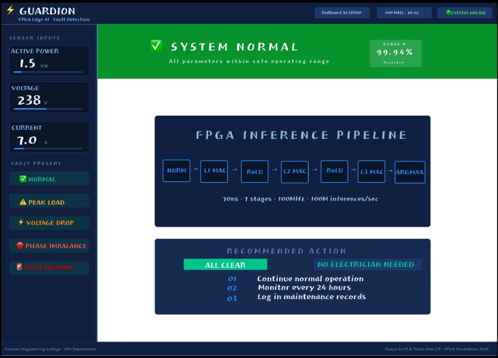
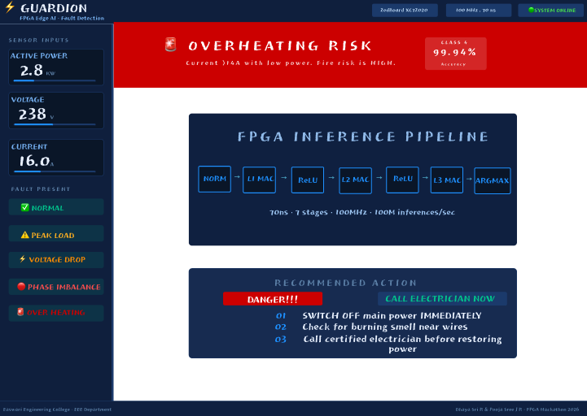
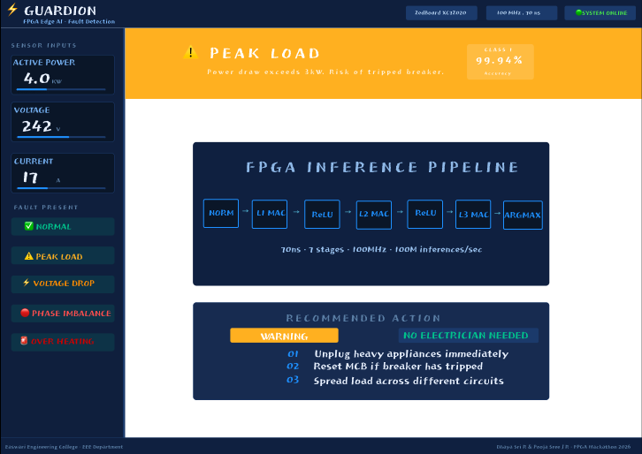
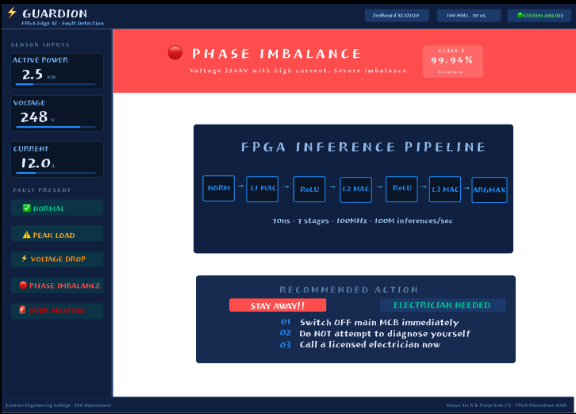
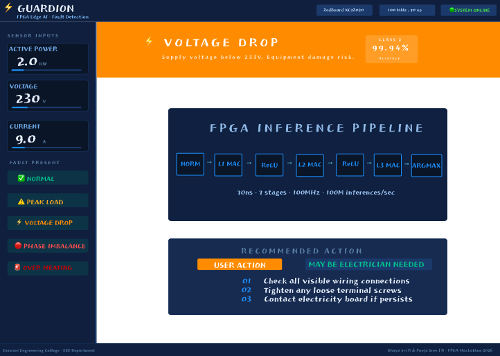

# Guardian Dashboard UI/UX Design

## Overview

Guardian is a dashboard interface designed to provide a clean and intuitive user experience.

## Problem Statement

Traditional monitoring systems often lack a centralized and user-friendly interface. The goal of Guardian Dashboard is to provide an intuitive platform for monitoring electrical parameters and system conditions.

## Objectives

• Improve user experience through a clean dashboard design.
• Provide real-time monitoring visualization.
• Enable quick identification of system abnormalities.
• Design a responsive and accessible interface.

## Tools Used

- Figma
- GitHub

## Key Features

• Normal Condition Monitoring
• Over Heating Detection
• Peak Load Monitoring
• Phase Imbalance Detection
• Voltage Drop Monitoring

## Prototype

[View Figma Prototype](https://www.figma.com/proto/hZJHfFGY4GFnFyhtgjQ60P/Guardion?node-id=8-110&p=f&viewport=-113%2C86%2C0.53&t=uNAPeJmWwZzShvD2-1&scaling=contain&content-scaling=fixed&page-id=0%3A1&starting-point-node-id=1%3A2)

## Screenshots

### Normal Condition

### Over Heating Detection

### Peak Load Monitoring

### Phase Imbalance Detection

### Voltage Drop Monitoring

## Future Enhancements

• Mobile-responsive dashboard design.
• Real-time IoT data integration.
• Interactive analytics and visualization.
• Alert and notification system.
• AI-based predictive maintenance features.
